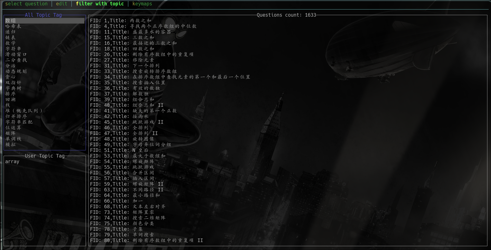

# 在终端下刷力扣

<!--toc:start-->

- [在终端下刷力扣](#在终端下刷力扣)
  - [安装](#安装)
  - [使用](#使用)
  - [视频](#视频)
  - [配置](#配置)
    - [重要部分](#重要部分)
    - [各个字段的说明](#各个字段的说明)
  - [Tui Keymap](#tui-keymap)
  - [模糊搜索](#模糊搜索)
  - [数据库错误](#数据库错误)
  <!--toc:end-->

## 安装

**Linux** 可选依赖(一个实现 SecretService 服务的应用)：

- gnome-keyring
- kwallet
- KeePassXC
- libsecret

---

- stable

```shell
cargo install --git=https://github.com/saying121/leetcode-cn-en-cli.git --tag=0.5.6 --force
```

- nightly

```shell
cargo install --git=https://github.com/saying121/leetcode-cn-en-cli.git --force
```

## 使用

生成配置，手动改配置也可以，在运行时会自动生成，
不带 `-c` 会以英文来生成

```shell
lcode gencon -c
```

先同步基本数据

```shell
lcode sync
```

查看帮助文档，开始选择题目

```shell
lcode -h
lcode fzy <edit>
```

## 视频

https://github.com/saying121/leetcode-cn-en-cli/assets/74663483/62b8f4cc-73dc-49db-a6a1-4823a640a13a

https://github.com/saying121/leetcode-cn-en-cli/assets/74663483/7917a65c-b7a9-4305-b87f-5d2ddc8cb760



## 配置

配置位置

- Linux: `~/.config/leetcode-cn-en-cli/config.toml`
- macos: `~/.config/leetcode-cn-en-cli/config.toml`
- Windows: `C:\Users\Alice\AppData\Roaming\config.toml`

代码默认位置

- Linux: `$HOME/.local/share`
- macOS: `$HOME/Library/Application Support`
- Windows: `C:\Users\Alice\AppData\Local`

默认:


cn 用户建议更改两处: `url_suffix = "cn"`, `translate = true`.

```toml
translate = true
column = 4
num_sublist = 10
page_size = 25
editor = ["vim"]
lang = "rust"
code_dir = "/home/user/.local/share/leetcode-cn-en-cli"

url_suffix = "cn"

[support_lang.rust]
start = "//start/"
end = "//end/"
inject_start = ""
inject_end = "struct Solution;\n\nfn main() {\n    println!(\"{:#?}\", Solution::function);\n}"
[support_lang.c]
...

browser = "edge"
[cookies]
csrf = ""
session = ""
```

### 重要部分

**首先在浏览器登陆 leetcode 来生成 cookies 。**

`browser` 可以填入 `chrome`, `edge`, `firefox`, `librewolf`。

目前只支持这几个浏览器，而且只在 Linux 系统测试过。(firefox 应该支持三个系统)
如果要使用这个选项，注意不要设置关闭浏览器时清空 cookies。

`[cookies]` 部分

- 如果两个子字段不为空则使用用户填写的内容。并不会使用其他方法获取 cookies。

  - 手动填写方法：

    从浏览器的 `leetcode.com/cn` 页面按下 <kbd>F12</kbd> ，
    找到 **Cookie** 字段，复制里面的 **csrftoken=<内容>;** 和 **LEETCODE_SESSION=<内容>;** 部分到配置里面。

- 然后如果用户填写了 `browser` ，则会尝试所填写浏览器获取 cookies 。

- 以上两个都没有填写则会自动以 _firefox_ -> _edge_ -> _chrome_ -> _librewolf_ 的顺序尝试获取 cookies 。

### 各个字段的说明

填入 `false` 或者 `true` ，默认 `false`，`true` 会使用翻译后的内容显示题目详情。

```toml
translate = true
```

---

获取 `submissionlist` 时显示几列

```toml
column = 4
```

---

显示最后多少条 `submissionlist` 信息

```toml
num_sublist = 10
```

---

交互选择题目时一次显示几道题目

```toml
page_size = 25
```

---

填写你的编辑器，会尝试从环境变量 `EDITOR` 和 `VISUAL` 获取，
否则为 `vim`

```toml
editor = ["vim"]
```

可以在后面添加参数

```toml
editor = ["vim", "--noplugin"]
```

---

设置你所选编程语言

```toml
lang = "rust"
```

---

设置代码和测试用例存储的位置

```toml
code_dir = "/home/user/.local/share/leetcode-cn-en-cli"
```

也可以这样写，以`~`开头

```toml
code_dir = "~/.local/share/leetcode-cn-en-cli"
```

---

填入 `com` 或者 `cn`，来设置网站后缀 `leetcode.com` 或者 `leetcode.cn`

```toml
url_suffix = "cn"
```

---

```toml
[support_lang.rust]
start = "//start/"
end = "//end/"
inject_start = ""
inject_end = "struct Solution;\n\nfn main() {\n    println!(\"{:#?}\", Solution::function);\n}"
[support_lang.c]
...
```

会根据这些生成代码模板

可以写为多行,`"""..."""`或者`'''...'''`：

```toml
inject_end = """struct Solution;
fn main() {
    println!("{:#?}", Solution::function());
}"""
```

例如: 108

```rust
// Definition for a binary tree node.
#[derive(Debug, PartialEq, Eq)]
pub struct TreeNode {
    pub val: i32,
    pub left: Option<Rc<RefCell<TreeNode>>>,
    pub right: Option<Rc<RefCell<TreeNode>>>,
}

impl TreeNode {
    #[inline]
    pub fn new(val: i32) -> Self {
        TreeNode {
            val,
            left: None,
            right: None,
        }
    }
}

//start/
// ...something
use std::cell::RefCell;
use std::rc::Rc;
impl Solution {
    pub fn sorted_array_to_bst(mut nums: Vec<i32>) -> Option<Rc<RefCell<TreeNode>>> {
        let len = nums.len();
        if len == 0 {
            return None;
        }
        let root = Rc::new(RefCell::new(TreeNode::new(nums[len / 2])));
        let mut right = nums.split_off(len / 2);
        right.remove(0);
        root.borrow_mut().left = Self::sorted_array_to_bst(nums);
        root.borrow_mut().right = Self::sorted_array_to_bst(right);

        Some(root)
    }
}
//end/

struct Solution;

fn main() {
    println!(
        "{:#?}",
        Solution::sorted_array_to_bst(vec![-10, -3, 0, 5, 9])
    );
}
```

在提交至力扣时只会提交 `support_lang.rust.start` 和 `support_lang.rust.start` 之间的内容,
如果没有找到这两个部分就提交全部内容。

## Tui Keymap

|              key               |  global   |
| :----------------------------: | :-------: |
| <kbd>Shift-Tab/⬅/➡/Tab</kbd> | 前/后 tab |
|       <kbd>Ctrl-r</kbd>        | 刷新屏幕  |
|       <kbd>Ctrl-q</kbd>        |   退出    |

|       key        |   tab0/select    |
| :--------------: | :--------------: |
|  <kbd>j/k</kbd>  |   下/上 个题目   |
| <kbd>gg/G</kbd>  | 第一个/最后一个  |
|   <kbd>o</kbd>   | 用你的编辑器打开 |
| <kbd>Enter</kbd> |    去编辑页面    |
|   <kbd>S</kbd>   |   同步题目信息   |

|        key        |          tab1/edit           |
| :---------------: | :--------------------------: |
|  <kbd>j/k</kbd>   |           滚动问题           |
|  <kbd>gg/G</kbd>  |          问题首/尾           |
| <kbd>ctrl-p</kbd> |         切换提交菜单         |
| <kbd>ctrl-s</kbd> |         切换提交结果         |
| <kbd>ctrl-t</kbd> |       切换提交测试结果       |
|   <kbd>S</kbd>    | 提交代码(仅在展示菜单时有效) |
|   <kbd>T</kbd>    | 测试代码(仅在展示菜单时有效) |

具体按键信息请在tui界面查看

## 模糊搜索

模糊搜索 tui 和 cli 的实现是一样的， cli 的 paid only 是 true ，在 tui 也可以输入 `true`/`P.O.: tru` 来筛选

## 数据库错误

由于 leetcode.cn 和 leetcode.com 获取的信息不同，在 cn 和 com 之间切换后有可能出现数据库的错误。

这时候请重新同步数据 `lcode sync -f` (推荐) ,或者在 Tui 界面在的一个tab按下 <kbd>S</kbd> 。
