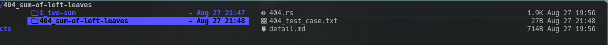

# 在终端下刷力扣

<!--toc:start-->
- [在终端下刷力扣](#在终端下刷力扣)
  - [安装](#安装)
  - [使用](#使用)
  - [视频](#视频)
  - [配置](#配置)
    - [首先](#首先)
    - [各个字段的说明](#各个字段的说明)
  - [Keymap](#keymap)
<!--toc:end-->

## 安装

-   stable

```shell
cargo install --git=https://github.com/saying121/leetcode-cn-en-cli.git --tag=0.4.0 --force
```

-   nightly

```shell
cargo install --git=https://github.com/saying121/leetcode-cn-en-cli.git --force
```

## 使用

生成配置，手动改配置也可以，在运行时会自动生成，
不带 `-c` 会以英文来生成

```shell
lcode gencon -c
```

先同步基本数据

```shell
lcode sync
```

查看帮助文档，开始选择题目

```shell
lcode -h
lcode fzy <edit>
```

## 视频

https://github.com/saying121/leetcode-cn-en-cli/assets/74663483/62b8f4cc-73dc-49db-a6a1-4823a640a13a

https://github.com/saying121/leetcode-cn-en-cli/assets/74663483/7917a65c-b7a9-4305-b87f-5d2ddc8cb760

## 配置

配置位置

-   Linux: `~/.config/leetcode-cn-en-cli/config.toml`
-   macos: `~/.config/leetcode-cn-en-cli/config.toml`
-   Windows: `C:\Users\Alice\AppData\Roaming\config.toml`

代码默认位置

-   Linux: `$HOME/.local/share`
-   macOS: `$HOME/Library/Application Support`
-   Windows: `C:\Users\Alice\AppData\Local`

默认:


cn 用户建议更改两处: `url_suffix = "cn"`, `translate = true`.

```toml
translate = true
column = 4
num_sublist = 10
page_size = 25
editor = ["vim"]
lang = "rust"
code_dir = "/home/user/.local/share/leetcode-cn-en-cli"

url_suffix = "cn"

[support_lang]
langs = ["rust", "bash", "c", "cpp", "csharp", "golang", "java", "javascript", "kotlin", "mysql", "php", "python", "python3", "ruby", "scala", "swift", "typescript", "racket", "erlang", "elixir", "dart"]

browser = "edge"
[cookies]
csrf = ""
session = ""
```

### 重要部分

**首先在浏览器登陆 leetcode 来生成 cookies。**

`browser` 可以填入 `edge`，`firefox`，`librewolf`

目前只支持这几个浏览器。
如果要使用这个选项，注意不要设置关闭浏览器时清空 cookies。

`[cookies]` 部分

-   如果两个子字段不为空则使用用户填写的内容。并不会使用其他方法获取 cookies。

    -   手动填写方法：

        从浏览器的 `leetcode.com/cn` 页面按下 <kbd>F12</kbd> ，
        找到 **Cookie** 字段，复制里面的 **csrftoken=<内容>;** 和 **LEETCODE_SESSION=<内容>;** 部分到配置里面。

-   然后如果用户填写了 `browser` ，则会尝试所填写浏览器获取 cookies。

-   以上两个都没有填写则会自动以 _edge_ -> _firefox_ -> _librewolf_ 的顺序尝试获取 cookies,

### 各个字段的说明

填入 `false` 或者 `true` ，默认 `false`，`true` 会使用翻译后的内容显示题目详情。

```toml
translate = true
```

---

获取 `submissionlist` 时显示几列

```toml
column = 4
```

---

显示最后多少条 `submissionlist` 信息

```toml
num_sublist = 10
```

---

交互选择题目时一次显示几道题目

```toml
page_size = 25
```

---

填写你的编辑器，会尝试从环境变量 `EDITOR` 和 `VISUAL` 获取，
否则为 `vim`

```toml
editor = ["vim"]
```

可以在后面添加参数

```toml
editor = ["vim", "--noplugin"]
```

---

设置你所选编程语言

```toml
lang = "rust"
```

---

设置代码和测试用例存储的位置

```toml
code_dir = "/home/user/.local/share/leetcode-cn-en-cli"
```

---

填入 `com` 或者 `cn`，来设置网站后缀 `leetcode.com` 或者 `leetcode.cn`

```toml
url_suffix = "cn"
```

## Keymap

|              key               |  global   |
| :----------------------------: | :-------: |
| <kbd>Shift-Tab/⬅/➡/Tab</kbd> | 前/后 tab |
|       <kbd>Ctrl-r</kbd>        | 刷新屏幕  |
|       <kbd>Ctrl-q</kbd>        |   退出    |

|       key        |   tab0/select    |
| :--------------: | :--------------: |
|  <kbd>j/k</kbd>  |   下/上 个题目   |
| <kbd>gg/G</kbd>  | 第一个/最后一个  |
|   <kbd>o</kbd>   | 用你的编辑器打开 |
| <kbd>Enter</kbd> |    去编辑页面    |

|        key        |          tab1/edit           |
| :---------------: | :--------------------------: |
|  <kbd>j/k</kbd>   |           滚动问题           |
|  <kbd>gg/G</kbd>  |          问题首/尾           |
| <kbd>ctrl-t</kbd> |         切换提交菜单         |
|   <kbd>S</kbd>    | 提交代码(仅在展示菜单时有效) |
|   <kbd>T</kbd>    | 测试代码(仅在展示菜单时有效) |
