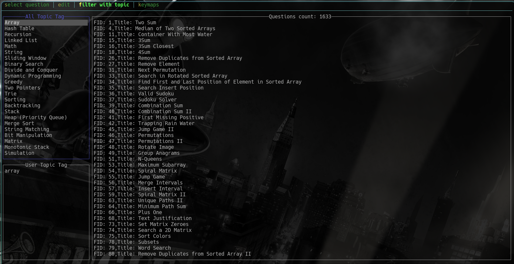

# Brush leetcode under the terminal

- 【[中文文档](./README-CN.md)】

<!--toc:start-->
- [Brush leetcode under the terminal](#brush-leetcode-under-the-terminal)
  - [🪶Features](#🪶features)
  - [💄Install](#💄install)
  - [🔧Usage](#🔧usage)
  - [📼Videos](#📼videos)
  - [⚙️Configuration](#️configuration)
    - [Cookies (Important)](#cookies-important)
    - [Keymap](#keymap)
    - [LANGS](#langs)
    - [CONFIG](#config)
    - [Here are the explanations for each field](#here-are-the-explanations-for-each-field)
  - [🔍Fuzzy Search](#🔍fuzzy-search)
  - [👣 The User Infos](#👣-the-user-infos)
<!--toc:end-->

## 🪶Features

- Open the editor of your choice for editing.
- Filter based on the category of the question.
- Perform a fuzzy search.
- Test and submit the code.
- Modify the test case.
- Automatically get cookies to eliminate the need for manual copying from
  the browser(support for a few specific browsers and platforms only,
  as adapting to various browsers and platforms can be complicated).

## 💄Install

**Linux** *Option dependencies*(a implement `SecretService` service Application)：

- `gnome-keyring`
- `kwallet`
- `KeePassXC`
- `libsecret`

**Linux** *dependencies* for notify：

- `libdbus`

---

- use the newest nightly toolchain

```shell
rustup default nightly
cargo install --locked --force lcode
```

## 🔧Usage

Generate configuration, manual modification of the configuration is also possible,
and it will be automatically generated at runtime.
Without -c, it will be generated in English.

```shell
lcode gencon -c
```

Synchronize basic data first.

```shell
lcode S
```

View the documentation for assistance.

```shell
lcode -h
```

Begin selecting a question.

```shell
lcode fzy <edit>
```

## 📼Videos

<https://github.com/saying121/leetcode-cn-en-cli/assets/74663483/57a633e5-6bae-4816-a224-d7d61d2141af>

<https://github.com/saying121/leetcode-cn-en-cli/assets/74663483/7917a65c-b7a9-4305-b87f-5d2ddc8cb760>



## ⚙️Configuration

### Cookies (Important)

> [!**First, login leetcode in browser for generate cookies**]

General you just need filled `~/.config/leetcode-cn-en-cli/config.toml`

```toml
browser = "edge" # `chrome`, `edge`, `firefox`, `librewolf` etc.
# Not casesensitive, `eDgE` also ok.
```

The detail: [decrypt-cookies](https://github.com/saying121/tidy-browser/tree/master/crates/decrypt-cookies#test-status)

`~/.config/leetcode-cn-en-cli/cookies.toml`

```toml
csrf = ""
session = ""
```

The `config.toml` field `browser` can fill in

If use the section，be careful not to clear cookies when closing the browser.

`[cookies]` section

- If the two subfields are not empty,use the content filled by the user.
  And not use other method to get cookies。

  - Fill in manually：

    Press <kbd>F12</kbd> on the browser's `leetcode.com/com` page,
    Find the **Cookie** field, copy the **`csrftoken`=\<$content\>;**
    and **`LEETCODE_SESSION`=\<$content\>;** copy the **$content** into the configuration.

- If user filled `browser` , will try to use the browser to get cookies.

- If neither of the above two items is filled in,
  and then use this order
  _firefox_ -> _librewolf_ -> _chrome_ -> _edge_ -> chromium
  -> brave -> Yandex ->  Vivaldi -> Opera -> OperaGX -> CocCoc
  try to get cookies.

### Keymap

[keymap](./KEYMAP.md)

### LANGS

[langs](./LANGS.md)

### CONFIG

The configuration located

- Linux: `~/.config/leetcode-cn-en-cli/config.toml`
- macos: `~/.config/leetcode-cn-en-cli/config.toml`
- Windows: `|C:\Users\Alice\AppData\Roaming`

The code default located

- Linux: `$HOME/.local/share/leetcode-cn-en-cli/`
- macOS: `$HOME/Library/Application Support/leetcode-cn-en-cli`
- Windows: `C:\Users\Alice\AppData\Local\leetcode-cn-en-cli`

default:


```toml
translate = false
column = 4
num_sublist = 10
page_size = 25
editor = ["vim"]
lang = "rust"
code_dir = "/home/user/.local/share/leetcode-cn-en-cli"
browser = ""

url_suffix = "com"
```

### Here are the explanations for each field

Checkout the [Cookies (Important)](#cookies-important) section above.

```toml
browser = false
```

Fill in `false` or `true`, default is `false`.
If `true` is chosen, the translated content
will be used to display the question details.

```toml
translate = false
```

---

When retrieving the **submissionlist**, how many columns should be displayed.

```toml
column = 4
```

---

How many recent entries of the submissionlist information should be displayed.

```toml
num_sublist = 10
```

---

How many questions should be displayed at once when interactively selecting a question.

```toml
page_size = 25
```

---

Fill in your editor, it will attempt to retrieve it from
the environment variables EDITOR and VISUAL,
otherwise it will default to vim.

```toml
editor = ["vim"]
```

You can add additional parameters at the end.

```toml
editor = ["vim", "--noplugin"]
```

---

Set your selected programming language.

```toml
lang = "rust"
```

---

Set the location for storing code and test cases.

```toml
code_dir = "/home/user/.local/share/leetcode-cn-en-cli"
```

You can also write it like this, starting with `~`

```toml
code_dir = "~/.local/share/leetcode-cn-en-cli"
```

---

Fill in `com` or `cn`, for set `leetcode.com` or `leetcode.cn`.

```toml
url_suffix = "com"
```

---

For better rust coding. It will add a `Cargo.toml` file

```toml
cargo_integr = true
```

## 🔍Fuzzy Search

Fuzzy search tui and cli implement is same，in cli paid only is true,
in tui also can input `true`/`P.O.: tru` for filter.

## 👣 The User Infos

You can ckeckout the infos/tab3 in tui for ensure cookies is valid.
